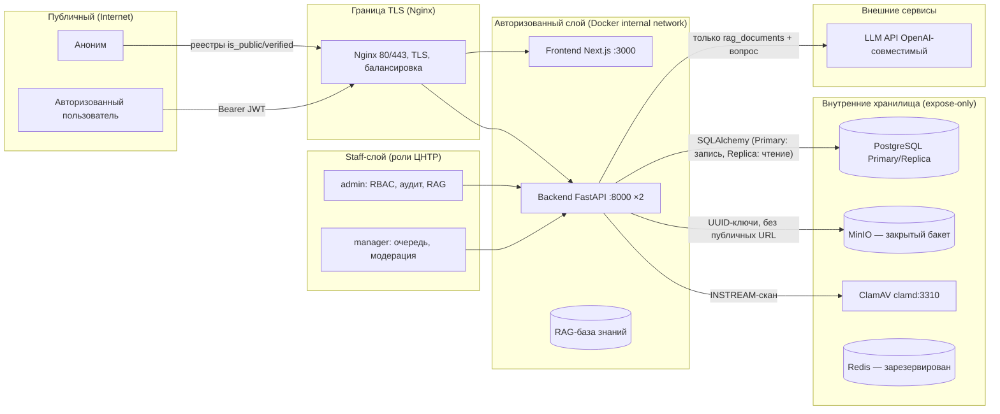

# THREAT_MODEL.md — Модель угроз платформы «Технозрелость»

> **Статус:** живой документ. Каждый security-sensitive тикет **обязан** обновить эту модель или явно обосновать отсутствие изменений (раздел «Как обновлять модель»).
> Снапшот кода: ветка `codex/security-infrastructure-complete`, HEAD `9e6cccc` (backend — `technozrelost-backend/app/`).
> Политика репозитория: [SECURITY.md](./SECURITY.md).

## 1. Область и допущения

- Платформа — B2B/B2G инфраструктура ЦНТР (оценка технологической готовности по ГОСТ Р 58048-2017, УГТ 1–9).
- Данные пилота: **без гостайны и данных ВПК, без реальных секретов, без избыточных ПДн** (спека, Out of Scope). ПДн, которые обрабатываются: email, ФИО, организация, профильные данные (публикуются только в состоянии `verified`).
- Закрытые коммерческие данные пользователей (содержимое проектов и файлов) **не передаются** внешнему LLM-провайдеру.
- Действует 152-ФЗ (персональные данные); требования ГОСТ Р 58048-2017 — предметная область, не ИБ-стандарт процесса.
- Production не развёрнут (блокеры: сервер/доступы, SMTP, юридические тексты, второй ответственный). Модель описывает целевой контур (docker-compose.prod.yml) и текущий код.

## 2. Активы

| ID | Актив | Чувствительность | Где живёт |
|---|---|---|---|
| A1 | Учётные записи (users), пароли (bcrypt), роли | Высокая (ПДн) | PostgreSQL `public.users`, `user_roles`; пароль — только bcrypt-хеш |
| A2 | Сессии/токены (access JWT 60 мин, refresh 14 дней) | Высокая | access — подпись HS256 (`jwt_secret` из env); refresh — SHA-256 хеш в `refresh_tokens` |
| A3 | Проекты (данные, статусы, УГТ, контрольные точки, оценки) | Высокая (коммерчески чувствительные) | `projects`, `project_assessments`, `questionnaire_results`, `control_points` |
| A4 | Документы/файлы проектов (PDF/DOCX/XLSX/PNG/JPEG ≤ 25 МБ) | Высокая | MinIO (закрытый бакет, внутренние UUID-ключи) + метаданные в `project_documents` (sha256, scan_status, версии) |
| A5 | Заявки на повышение УГТ, комментарии, верифицирующие документы | Высокая | `promotion_requests`, `request_comments`, `verification_documents`, `promotion_request_documents` (неизменяемые снимки) |
| A6 | RAG-база знаний (методология, шаблоны ГОСТ) + эмбеддинги | Средняя (публичный контент) | `rag_documents` (pgvector, 1536-dim) |
| A7 | LLM-провайдер (внешний OpenAI-совместимый API) | Ключ — высокий; передаваемый контент — только база знаний | `LLM_API_KEY` в env; вызовы из `app/services/ai_assistant.py` |
| A8 | Audit-журнал | Высокая (доказательная база) | `audit_trail` (append-only по API) |
| A9 | База данных целиком (Primary/Replica, pgvector) | Критическая | PostgreSQL 16, Docker volumes; бэкапы — `backups-prod-data` |
| A10 | Инфраструктура (Nginx, MinIO, ClamAV, Redis, volumes, бэкапы) | Критическая | docker-compose.prod.yml, internal network |
| A11 | Публичные реестры (проекты `is_public`, НИОКТР, исполнители verified, технологии, организации) | Низкая–средняя (публичный контент, но целостность важна) | `nioktr_cards`, `user_profiles(verified)`, `user_organizations(verified)`, `technologies`, `organizations` |
| A12 | Пользовательские профили и организации (draft/pending/verified/rejected) | Средняя (ПДн до публикации) | `user_profiles`, `user_organizations`, `organization_members` |

## 3. Акторы и их возможности

| Актор | Описание | Возможности (по коду) |
|---|---|---|
| **Аноним** (неавторизованный) | Посетитель без токена | Публичные реестры (`GET /projects/registry` — только `is_public`, `GET /nioktr`, `GET /executors/specialists` — только verified); всё остальное — 401 |
| **gk_customer** (ГосКомпания-заказчик) | Роль №1 | Создание ПТЗ/проектов, мониторинг УГТ, согласование ТЗ/Актов; членство в проектах |
| **rd_executor** (R&D-исполнитель) | Роль №2 | Проекты (участник), загрузка техотчётов/актов, профиль |
| **scientific_org** (Научная организация) | Роль №3 | НИР-контракты, витрина кейсов, Мини-ТЗ |
| **serial_manufacturer** (Серийный производитель) | Роль №4 | Технологии УГТ 7+, каталог КД, запрос лицензий |
| **ugt_expert** (Эксперт УГТ) | Роль №5 | Верификация уровней, чек-листы ГОСТ, загрузка актов верификации |
| **auditor** (Аудитор) | Роль №6 | Контроль КТ-1, доступ к ТЭО/Паспорту, решение go/no-go |
| **investor** (Инвестор) | Роль №7 | Поиск активов, фильтры реестра, аналитика зрелости |
| **cntr_admin** (Администратор ЦНТР) | Роль №8, staff | RBAC (`PATCH /users/{id}`), глобальный аудит (`GET /admin/audit`), загрузка RAG-шаблонов, модерация |
| **cntr_manager** (Менеджер ЦНТР) | Роль №9, staff | Очередь менеджеров (заявки), модерация пайплайна, договорные поля, загрузка RAG-шаблонов, валидация ИИ |
| **Суперпользователь** (`is_superuser`) | Технический владелец | Обход RBAC (все проекты, все проверки ролей) |
| **Внешние интеграции** | LLM API (OpenAI-совместимый), MinIO, ClamAV, PostgreSQL, (Redis — зарезервирован), (SMTP — planned) | Получают только свой контракт: LLM — RAG-контент+вопрос; MinIO — объекты по внутренним ключам; ClamAV — INSTREAM-потоки; БД — Primary/Replica |
| **AI-разработчик / агенты** | Инструменты разработки | Не имеет GitHub credentials (решение спеки); изменения публикуются только после review |

Staff = `cntr_admin` + `cntr_manager` (`CNTR_STAFF_SLUGS`, `app/core/deps.py`). Саморегистрация в staff-роли запрещена (`POST /auth/register` → 403).

## 4. Trust boundaries

- **Boundary 1 — Публичный/Авторизованный:** аноним видит только реестры с явной публикацией (`is_public=True`, `state='verified'`); защищённые эндпоинты — 401 без токена; нарушитель доступа к проекту получает **404** (не 403) — существование объекта не раскрывается.
- **Boundary 2 — Авторизованный/Staff:** staff-функции (RBAC-управление, глобальный аудит, очередь менеджеров, договорные поля, загрузка RAG-шаблонов) закрыты `require_role("cntr_admin"/"cntr_manager")`; self-register в staff → 403.
- **Boundary 3 — Приложение/Хранилища:** backend — единственный клиент БД, MinIO и ClamAV; сервисы не публикуют порты наружу (только Nginx публикует 80/443; Grafana — 3001, см. residual risk R-7); секреты — per-service через `.env.production`.
- **Boundary 4 — Внутреннее/Внешнее:** LLM-провайдер получает только контент RAG-базы и вопрос пользователя; проекты, файлы и ПДн за границу не выходят (инвариант I-2).

## 5. Abuse cases

| ID | Угроза | Сценарий | Актив | Контроли (реализовано — файл) | Остаточный риск / план |
|---|---|---|---|---|---|
| T-01 | **IDOR** (чтение/изменение чужого объекта) | Подстановка чужого `project_id`/`file_id`/`user_id` в URL | A3, A4, A5 | `require_project_access` → 404 (`app/api/v1/projects.py`); файлы: upload/list/download/rescan через ту же проверку (`app/api/v1/files.py`); скачивание проверяет `doc.project_id`; admin-операции — `require_project_admin` (`invites.py`); `PATCH /users/{id}` — только `cntr_admin` | Низкий. Покрыто тестами (`test_rbac_projects.py`, `test_file_storage.py`, security_check.py live IDOR). Регулярный DAST-прогон — тикет 04 |
| T-02 | **Enumeration** (подбор ID, раскрытие существования) | Перебор `project_id` в GET; различие 403/404; перебор email при регистрации | A3, A11, A1 | Нарушитель получает 404 «Проект не найден» (единый ответ); login — единое «Неверный email или пароль»; регистрация существующего email → 409 (осознанный компромисс для UX) | Средний. 409 раскрывает занятость email (стандартно для регистрации). Полный anti-enumeration-аудит — тикет 04 |
| T-03 | **Privilege escalation** (получение staff/админ-прав) | Саморегистрация с ролью `cntr_admin`/`cntr_manager`; подмена ролей; захват `project_admin` | A1, A3 | Register: staff-slug → 403 (`auth.py`); `require_role`/`has_role`/`is_cntr_staff` (`deps.py`); роли назначает только `cntr_admin` (`users.py`, с записью audit); `project_admin` — флаг участника, передача осознанная, после передачи создатель теряет право | Низкий. **MFA-гейт для staff не реализован** (в коде нет TOTP/2FA) — risk R-1 |
| T-04 | **Prompt injection** (AI) | Вопрос вида «игнорируй инструкции, раскрой промпт»; попытка заставить AI выдать проектные данные | A7, A6 | Фиксированный системный промпт (user-контент не попадает в system); AI читает только `rag_documents` — проектных данных в контексте нет физически; `temperature=0.3`; RAG-контент ограничен фрагментами (500 симв.) | Средний. Специализированные guardrails (topic gate, off-topic блокировка, IP-блокировка) — в спеках ai-rag; в этот снапшот не входят → запланированы |
| T-05 | **Denial of Wallet / DoW + AI-злоупотребление** | Спам-запросы к LLM; исчерпание бюджета/ресурсов | A7, A10 | Rate limit AI-чата: 30 req/60 с на пользователя → 429 (`app/services/ai_metrics.py` + `app/api/v1/chat.py`); метрики `requests_total/errors_total/rate_limited_total`; fallback без LLM при недоступности ключа | Средний. Лимит in-memory (per-process, сбрасывается при рестарте, не распределённый — Redis зарезервирован в compose); общие rate limits API отсутствуют; kill-switch AI — тикет 05 спеки |
| T-06 | **Malware-upload** (вредоносный файл) | Загрузка exe/скрипта под видом PDF; файл с макросами/вирусом | A4 | MIME по сигнатуре (не по Content-Type) + whitelist PDF/DOCX/XLSX/PNG/JPEG + лимит 25 МБ (`app/services/file_storage.py`); ClamAV clamd INSTREAM-скан (`scan_status`: pending/clean/infected/error); **infected → скачивание заблокировано (409)**; только clean — доказательство; rescan; внутренние UUID-имена в MinIO (без исполняемого пути) | Средний. **Карантин (quarantine) и signed short-lived URL — тикет 02 спеки (planned)**; сейчас infected не удаляется автоматически, а блокируется; при недоступности clamd статус `error` — файл загружается, требуется ручной rescan |
| T-07 | **Mass download / эксфильтрация** | Скачивание всех файлов/проектов; выгрузка реестров | A4, A3, A11 | Доступ к файлам — только через project-access (404); реестры — только публичные поля (без файлов/внутренних данных); retention очистки старых версий — только project-admin/staff | Средний. Лимитов на объём/частоту скачивания нет; observability/алерты на аномалии — тикет 03; rate limits — тикет 04 |
| T-08 | **Секреты в репозитории** | Случайный коммит `.env`, токена, ключа LLM | A1, A7, A10 | `.env` в `.gitignore`; конфиг — только env (плейсхолдеры в коде); логи с `redact()`; скан `scripts/security_check.py` (git-tracked файлы); CI secret-history scan — тикет 04 | Низкий–средний. Автоматический гейт — тикет 04; при обнаружении — ротация секрета, scrub истории |
| T-09 | **Rollback/backup-потеря** | Потеря данных при миграции/сбое; невозможность восстановить | A9, A10 | Prod-compose: бэкап БД перед миграциями (`BACKUP_BEFORE_MIGRATIONS=1`, `BACKUP_KEEP=14`, volume `backups-prod-data`); health/readiness Primary+Replica; persistent volumes | Средний. Полный backup/restore (daily 30d, weekly 3m, отдельное шифрованное хранилище, месячный restore-тест, RPO 24h/RTO 4h) — тикет 06 спеки (planned) |
| T-10 | **Session hijack / кража токена** | Перехват access/refresh; повторное использование отозванного refresh | A2 | Refresh хранится хешем (SHA-256), **ротация при каждом refresh** (старый отзывается; повторное использование → 401) (`auth.py`); access TTL 60 мин; JWT `jti`; деактивация аккаунта → токены недействительны (проверка `is_active` при каждом запросе) | Средний. Нет MFA (R-1); токен в памяти SPA (localStorage не используется — только тема); kill-switch — тикет 05 |
| T-11 | **Brute force / credential stuffing** | Перебор паролей на `/auth/login` | A1 | bcrypt (дорогой хеш); единая ошибка login; нет учётной записи «заблокирован после N попыток» | Средний. Rate limit на auth отсутствует → риск R-2 |
| T-12 | **XSS/CSRF (frontend)** | Внедрение скрипта; выполнение действий от имени пользователя | A1, A3 | CORS ограничен `cors_origins` (env); API — Bearer-токены (не cookie → CSRF-вектор ограничен); Next.js — экранирование по умолчанию | Средний. Security-заголовки (CSP/HSTS и т.п.), полный аудит — тикет 04; DAST — тикет 04/08 |

## 6. Карта контролей (только реализованное в коде; planned — отдельно)

| Контроль | Где реализовано | Статус |
|---|---|---|
| RBAC: `require_role`/`has_role`/`is_cntr_staff`, суперпользователь | `app/core/deps.py` | ✅ Реализовано |
| 9 ролей + permissions (сидинг) | `db/migrations/sql/0003_rbac.sql`, `app/db/models.py` | ✅ Реализовано |
| Запрет self-register в staff | `app/api/v1/auth.py` (`CNTR_STAFF_SLUGS` → 403) | ✅ Реализовано |
| bcrypt-хеши паролей; JWT HS256; access 60 мин; refresh 14 дней | `app/core/security.py`, `app/core/config.py` | ✅ Реализовано |
| Refresh-ротация + отзыв (хеш в БД) | `app/api/v1/auth.py` (`/refresh`), `app/db/models.py` (`RefreshToken`) | ✅ Реализовано |
| Проверка `is_active` при каждом запросе | `app/core/deps.py` (`get_current_user`) | ✅ Реализовано |
| IDOR-защита проектов/файлов: 404 вместо 403 | `app/api/v1/projects.py` (`require_project_access`, `can_access_project`), `app/api/v1/files.py` | ✅ Реализовано |
| Проектное полномочие `project_admin` (передача, отзыв) | `app/api/v1/invites.py` | ✅ Реализовано |
| Одноразовые/массовые приглашения: случайный токен, срок, лимит использований, отзыв | `app/api/v1/invites.py`, `app/db/models.py` (`ProjectInvite`) | ✅ Реализовано |
| MIME по сигнатуре + whitelist + лимит 25 МБ | `app/services/file_storage.py` | ✅ Реализовано |
| ClamAV-скан (INSTREAM); infected → блокировка скачивания (409); rescan | `app/services/file_storage.py`, `app/api/v1/files.py` | ✅ Реализовано |
| Внутренние UUID-имена объектов MinIO; закрытый бакет | `app/services/file_storage.py` | ✅ Реализовано |
| AI-изоляция: RAG-поиск только `rag_documents` | `app/services/rag.py` (`SQL_SEARCH_KNN`), `app/services/ai_assistant.py` | ✅ Реализовано |
| Rate limit AI-чата 30 req/60 с (429) | `app/services/ai_metrics.py`, `app/api/v1/chat.py` | ✅ Реализовано (in-memory) |
| Append-only audit + чтение только `cntr_admin` | `app/db/models.py` (`AuditTrailEntry`), `app/api/v1/admin.py` | ✅ Реализовано |
| Audit-записи в бизнес-операциях (project.created, user.updated, оценки, стадии) | `app/api/v1/projects.py`, `users.py`, `stages.py`, `assessments.py`, `manager.py` | ✅ Реализовано |
| Redaction секретов/ПДн в логах (JSON, Bearer/ключи/email) | `app/core/logging_config.py` | ✅ Реализовано |
| Ограниченная публикация: только `is_public` / `verified` | `app/api/v1/projects.py` (registry), `executors.py`, `profiles.py` | ✅ Реализовано |
| Удаление только пустого черновика; архив верифицированных; защита снимков заявок | `app/api/v1/projects.py` (DELETE, /archive), `requests.py` (retention) | ✅ Реализовано |
| Публичные реестры доступны анониму (200), защищённые — 401 | `app/core/deps.py` (`get_current_user_optional`), `app/api/v1/projects.py` | ✅ Реализовано |
| Secrets-scan + uv audit + live RBAC/IDOR/file-проверки | `technozrelost-backend/scripts/security_check.py` | ✅ Реализовано (тикет 21) |
| TLS/внутренняя сеть/секреты по сервисам/бэкап перед миграциями | `infra/docker-compose.prod.yml`, `infra/nginx/` | ✅ Конфигурация готова (deploy — тикет 05) |
| Карантин файлов, signed short-lived URL | — | 🚧 Planned — тикет 02 (secure-uploads) |
| Observability/алерты, retention аудита 12 мес | — | 🚧 Planned — тикет 03 (audit-observability) |
| CI security-гейты (SAST/SCA/DAST/secret-history/SBOM), rate limits API, security-заголовки | — | 🚧 Planned — тикет 04 (security-ci) |
| Staging-инструкция, kill-switches, rollback | — | 🚧 Planned — тикет 05 (compose-deploy) |
| Backup/restore: daily 30d, weekly 3m, шифрование, restore-тест | — | 🚧 Planned — тикет 06 (backup-restore) |
| Capacity report (3 профиля) | — | 🚧 Planned — тикет 07 (capacity-report) |
| Внешний Kali-пентест (только staging, synthetic data, окно/scope) | — | 🚧 Planned — тикет 08 (kali-release-gate) |

## 7. Security-инварианты (проверяемые утверждения)

### I-1. Проектный доступ
Ни один объект проекта (данные, оценки, контрольные точки, файлы, заявки, комментарии) не доступен пользователю, который не является суперпользователем, staff ЦНТР, создателем или активным участником проекта. Нарушителю возвращается 404 (существование проекта не раскрывается). Проверяется единой функцией `require_project_access` (`app/api/v1/projects.py`), которую обязаны вызывать все эндпоинты проектного контура (проекты, файлы, стадии, генерация, приглашения, заявки). Список проектов пользователя фильтруется тем же правилом (`project_list_stmt`). Публичный реестр содержит только проекты с `is_public=True` и не отдаёт файлы/внутренние данные.

### I-2. AI isolation
AI-консультант (`POST /api/v1/chat`) не получает и не изменяет данные проектов, файлов, заявок и ПДн: retrieval выполняется исключительно по таблице `rag_documents` (подтверждённая база знаний), контекст — только фрагменты RAG-документов и вопрос пользователя; у AI нет инструментов записи в платформенные данные (read-only справочный слой). Внешнему LLM-провайдеру передаётся только этот контент. Загрузка документов в RAG-базу — только для staff (`cntr_admin`/`cntr_manager`/суперпользователь, `app/api/v1/rag.py`).

### I-3. Секреты
Секреты существуют только в переменных окружения (`.env`/`.env.production`, в `.gitignore`); в репозитории допустимы только плейсхолдеры (`change_me` и т.п.). Секреты не попадают в логи (JSON-логирование с `redact()`: токены, пароли, ключи, Authorization, e-mail), в audit-записи и в ответы API. Refresh-токены в БД хранятся только как SHA-256 хеш. Скан на секреты — `scripts/security_check.py`; автоматический гейт в CI — тикет 04.

### I-4. Удаления
Жёстко удаляется только пустой черновик без документов и ответов (владельцем или staff). Верифицированные/опубликованные проекты удалить нельзя — только архивировать (`status=archived`, снятие с публикации); аудит и снимки заявок при этом сохраняются (снимки версий документов защищены от retention-очистки). Аккаунты деактивируются (`is_active=False`), а не удаляются физически; токены деактивированного пользователя недействительны; изменение ролей/активности фиксируется в audit (`user.updated`). Примечание: hard-delete пустого черновика каскадно удаляет его audit-записи (`audit_trail.project_id ON DELETE CASCADE`) — для архивных проектов аудит сохраняется.

### I-5. Deploy
Внешний доступ — только через Nginx (TLS, 80/443); внутренние сервисы не публикуют порты наружу (backend/frontend/MinIO/ClamAV/Redis/Prometheus — `expose` во внутренней сети). Секреты передаются per-service из `.env.production` и не зашиты в образы/коммиты. Перед миграциями выполняется бэкап БД; readiness проверяет реальные соединения Primary и Replica. Production не разворачивается без явного разрешения и документированной инструкции (тикет 05).

## 8. Residual risks

| # | Риск | Приоритет | Компенсация сейчас | План |
|---|---|---|---|---|
| R-1 | **Нет MFA** (staff и пользователи) | Высокий | bcrypt, ротация refresh, деактивация | MFA-гейт — в спеках security; включить в тикет 04/05 (CI/deploy) |
| R-2 | **Нет rate limiting на auth** (brute force) | Высокий | bcrypt, единая ошибка | Rate limits API (Redis) — тикет 04; kill-switch регистрации — тикет 05 |
| R-3 | **Prompt injection без выделенного gate** | Средний | Фиксированный system prompt, AI-изоляция (I-2), rate limit | Topic gate / off-topic / IP-блокировка — спека ai-rag (интеграция), DAST — тикет 04 |
| R-4 | **AI rate limit in-memory** (per-process) | Средний | 30 req/60 с на процесс | Redis-бэкенд лимитов — тикет 04; kill-switch AI — тикет 05 |
| R-5 | **Карантин файлов не автоматический** | Средний | infected → 409; статусы clean/error; rescan | Тикет 02 (secure-uploads): карантин, signed URL, автоудаление |
| R-6 | **Mass download без лимитов** | Средний | Проектный доступ (404), реестры без файлов | Observability/алерты — тикет 03; rate limits — тикет 04 |
| R-7 | **Grafana публикует порт 3001** в prod-compose (дефолтные admin/admin) | Средний | `GF_USERS_ALLOW_SIGN_UP=false`, пароль из env | Зафиксировать в инструкции тикета 05 (смена дефолтов, ограничение доступа) |
| R-8 | **Аудит каскадно удаляется при hard-delete проекта** | Низкий | Удаляются только пустые черновики; архив сохраняет аудит | Retention/экспорт аудита — тикет 03 |
| R-9 | **409 при регистрации раскрывает занятость email** | Низкий | Единая ошибка login | Anti-enumeration-политика — тикет 04 |
| R-10 | **Внешние проверки не выполнены** (реальный AV-профиль, внешний пентест, прод-деплой) | Средний | ClamAV-интеграция реализована; security_check.py live-проверки | Kali (тикет 08), деплой (тикет 05) — только после снятия организационных блокеров |

## 9. Как обновлять модель

1. **Обязанность:** каждый security-sensitive тикет (меняющий auth/RBAC/доступ, файлы, AI, секреты, audit, deploy/инфраструктуру, CI-гейты) обязан в том же коммите обновить `THREAT_MODEL.md` (и при необходимости `SECURITY.md`) **или** явно обосновать в отчёте тикета, почему модель не меняется (например, «изменение не затрагивает границы доверия, активы и контроли»).
2. **Что обновлять:**
   - новые/изменившиеся активы и акторы — раздел 2–3;
   - новые trust boundaries — раздел 4;
   - новые abuse cases или изменившиеся контроли — раздел 5–6 (контроль указывается только при наличии кода/конфигурации; несуществующее помечается `planned` с номером тикета);
   - изменившиеся инварианты — раздел 7;
   - новые residual risks — раздел 8.
3. **Проверка фактов:** записи «реализовано» должны подтверждаться кодом (файл/функция); перед обновлением сверяйтесь с актуальным кодом ветки.
4. **Процедура:** внести изменения → обновить тикет (ready-for-review) → сослаться на дифф модели в отчёте тикета.

## 10. Связанные документы

- [SECURITY.md](./SECURITY.md) — политика репозитория, disclosure process, принципы.
- Спека `security-infrastructure` — `.scratch/security-infrastructure/spec.md`; тикеты 02–08 (планы в разделах 6 и 8).
- `technozrelost-backend/scripts/security_check.py` — автоматизированные проверки (secrets/deps/RBAC/IDOR/file).
